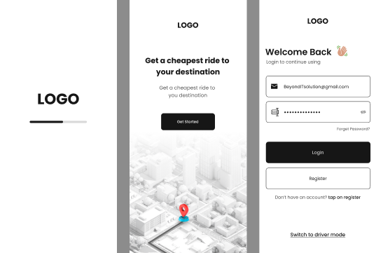

# CITY GO

CITY GO is a ride-hailing app that allows users to book rides, view ride history, chat with drivers, and more. The app is built using Expo and React Native for the front-end, and Python for the back-end.



## Table of Contents

- [Description](#description)
- [Features](#features)
- [Installation](#installation)
- [Usage](#usage)
- [Contributing](#contributing)
- [Screenshots](#screenshots)
- [Contact](#contact)

## Description

CITY GO is a clone of Uber, and it aims to provide a similar user experience. The app is built using Expo and React Native for the front-end, and Python for the back-end. It features two modes: Driver and Rider. Riders can book rides, view ride history, chat with drivers, see their balances, apply coupons, and more. Drivers can switch on and off their searching mode, receive ride requests, accept rides, and chat with riders during the trip.

## Features

- Two modes: Driver and Rider
- Rider mode features:
  - Book rides
  - View ride history
  - Chat with drivers
  - View balance
  - Apply coupons
- Driver mode features:
  - Switch on and off searching mode
  - Receive ride requests
  - Accept rides
  - Chat with riders during trips

## Installation

To install CITY GO, follow these steps:

1. Clone the repository:

```bash
$ git clone https://github.com/yourusername/city-go.git
```
2. Install the dependencies for the front-end:

```bash
$ cd city-go
$ npm install
```
3. Download Backend Python Code from https://github.com/BinaryBreaker/CityGoBackend

4. Run the app:
```bash
$ npx expo start

````
5. Change the ServerURL in APIUrls.js to your local django URL

## Usage


Install the Expo app on your device (iOS or Android) and scan the QR code to launch the app.
Usage
To use CITY GO, follow these steps:

Launch the app on your device by scanning the QR code.
Choose your mode (Driver or Rider).
If you're a Rider, you can book a ride by entering your pickup and dropoff locations.
If you're a Driver, you can switch on searching mode and wait for ride requests. You will receive a notification when a rider has requested a ride, and you can then accept the ride and chat with the rider during the trip.

## Contributing
If you would like to contribute to CITY GO, please follow these guidelines:

Fork the repository
Create a new branch
Make your changes
Push to your branch
Submit a pull request
Please make sure to run tests and lint the code before submitting your pull request.

## Screenshots


## Contact
If you have any questions or comments, please contact me at adil.raja7943@gmail.com .

